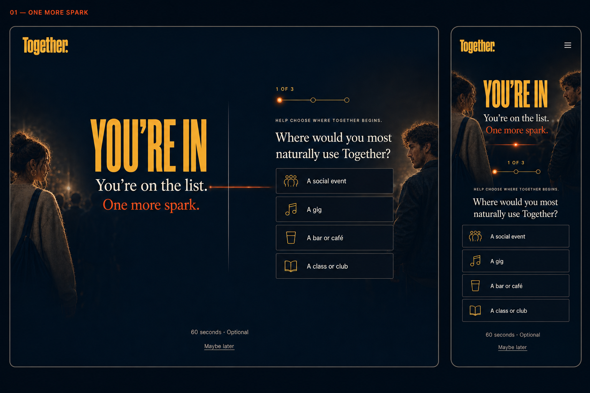
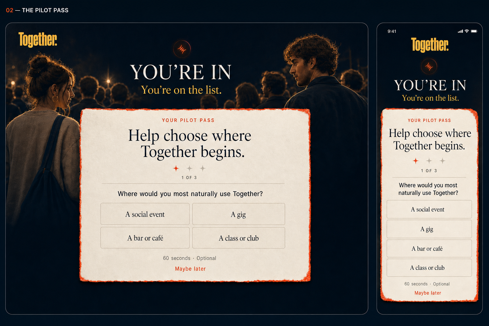
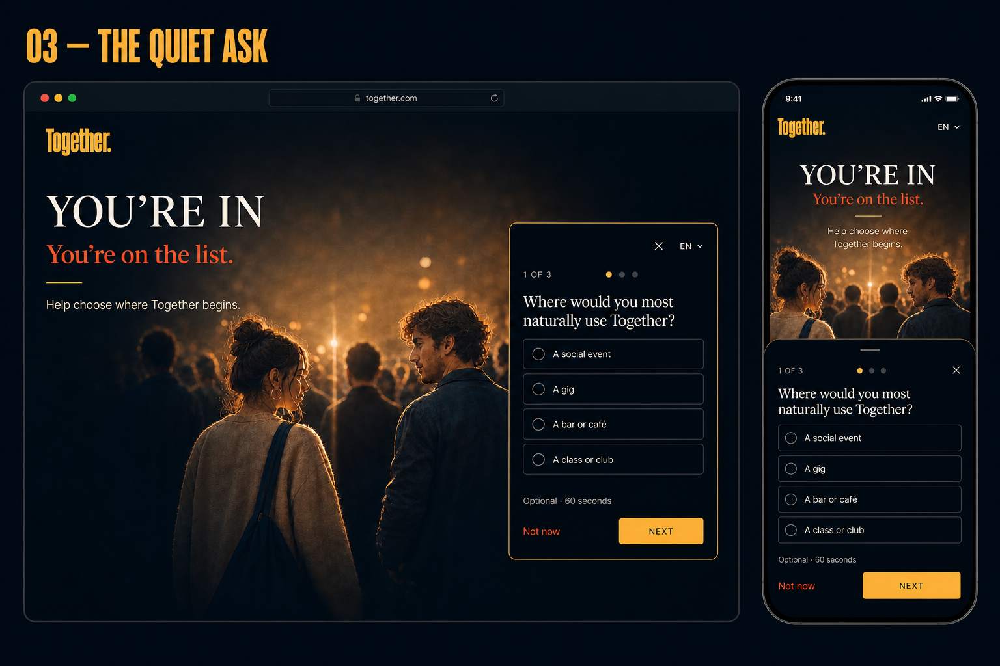

# Together survey integration concepts

**Status:** One More Spark approved and implemented locally  
**Selected direction:** 01 — One More Spark  
**Approved image:** [`01-one-more-spark.png`](01-one-more-spark.png)  
**Approval date:** 2026-07-27  
**Surface:** Post-confirmation qualification  
**Primary conversion:** `launch_interest_confirmed`  
**Qualification conversion:** `launch_qualification_completed / launch_interest_confirmed`

## Approved interaction contract

- Make the survey available as an optional public research surface, with an
  email opt-in at the end for people who also want the first invitation.
- After registration, suggest the qualification only when the participant has
  not already completed it.
- Keep the confirmation and first question in one continuous view.
- Show one question at a time and auto-advance after a structured answer.
- Use the three-point spark treatment for progress.
- Keep “60 seconds · Optional” and “Maybe later” visible.
- Preserve `launch_interest_confirmed` as the independent appetite signal.
- Keep qualification answers in Together's first-party data store; send only
  lifecycle events without answer values to analytics.
- Treat the approved image as the visual contract. Copy and question wording
  may be refined before implementation without changing the interaction model.

## Implemented qualification

The local implementation asks one structured question at a time:

1. Natural place type: social event, gig, bar or café, or class or club
2. Broad London area where the participant spends social time
3. Adult eligibility

Responses are saved only after the third answer. The protected admin view shows
the structured values and completion time. Leaving the launch list deletes the
qualification through the registration relationship.

## Product boundary

The supplied pilot document contains three operational forms:

1. Profile onboarding
2. Weekly intent
3. Post-meeting follow-up

They should not be coupled wholesale to launch registration. The current
appetite test should preserve confirmed email registration as its independent
demand signal.

This design round previews a maximum three-question, optional qualification
flow. The same first question and answer set appear in every direction so the
comparison concerns the integration mechanic rather than different survey
content.

## Shared behavioural principles

- Ask immediately after confirmation, when commitment and momentum are highest.
- Confirm success before asking for anything else.
- Make the participant's contribution concrete: it helps choose where Together
  begins.
- Show that the step takes 60 seconds and is optional.
- Use one question per view, large answer targets, and automatic progression.
- Do not use fake scarcity, fabricated participation counts, or a forced
  completion state.
- Do not send contact details, dating preferences, accessibility information,
  safety information, or free text to analytics.

## Directions

### 01 — One More Spark

The first question is visible in the confirmed state, making the survey feel
like the natural continuation of joining.

**Strength:** Lowest activation energy and likely highest completion.

**Trade-off:** The survey competes slightly with the emotional confirmation
moment.

**Recommendation:** Strongest default.

### 02 — The Pilot Pass

Confirmation gives the participant a tangible invitation, and the survey
appears as the act of shaping that invitation.

**Strength:** Creates ownership and makes early participation desirable.

**Trade-off:** More visual ceremony and one more conceptual step than the
inline direction.

### 03 — The Quiet Ask

A compact popover or mobile bottom sheet asks the same question without
changing the confirmation page's core structure.

**Strength:** Fastest to ship and easiest to target or dismiss.

**Trade-off:** Feels like a survey widget rather than part of Together and is
easier to ignore.

## PostHog boundary

PostHog currently supports:

- Programmatic display of a prebuilt survey with `displaySurvey`
- API-presentation surveys through `getActiveMatchingSurveys`
- Custom response capture through `survey_sent`

Those capabilities make PostHog suitable for triggering, exposure measurement,
and experiments. They do not make it the right owner for sensitive pilot
answers.

The recommended production boundary is:

- Together renders the approved first-party interface.
- Together stores structured answers in its own database against an opaque
  qualification token.
- Analytics receives only lifecycle events:
  `launch_qualification_viewed`, `launch_qualification_started`, and
  `launch_qualification_completed`.
- PostHog is added only when targeting, replay, or an actual prompt experiment
  justifies the additional dependency. Existing GA can measure the initial
  lifecycle events.

## Options not selected for preview

- **Survey plus optional email opt-in:** selected as the public research path.
  It keeps confirmed registration as the appetite signal while making research
  participation useful to people who are not ready to register yet.
- **Blocking email confirmation:** rejected because qualification is not
  required to confirm demand.
- **External Typeform, Tally, or Google Form:** useful for an operator-run pilot
  if speed dominates, but creates a brand and trust break and fragments data
  retention.
- **Email-only survey link:** useful as a single reminder and return path, but
  weaker than asking at the high-momentum confirmation moment.
- **Full profile onboarding:** defer until someone accepts an invitation to the
  actual pilot and the storage, retention, safety, and operator-access rules
  are approved.

## Measurement

Use one chosen direction initially rather than splitting the first small cohort
across three underpowered variants.

- Primary: `launch_qualification_completed / launch_interest_confirmed`
- Step diagnostics: answer completion by question number
- Guardrail: `launch_interest_confirmed / landing_viewed`
- Quality check: proportion of completed qualifications that satisfy the
  approved adult and launch-market eligibility rules

Do not include answer values in analytics events.
