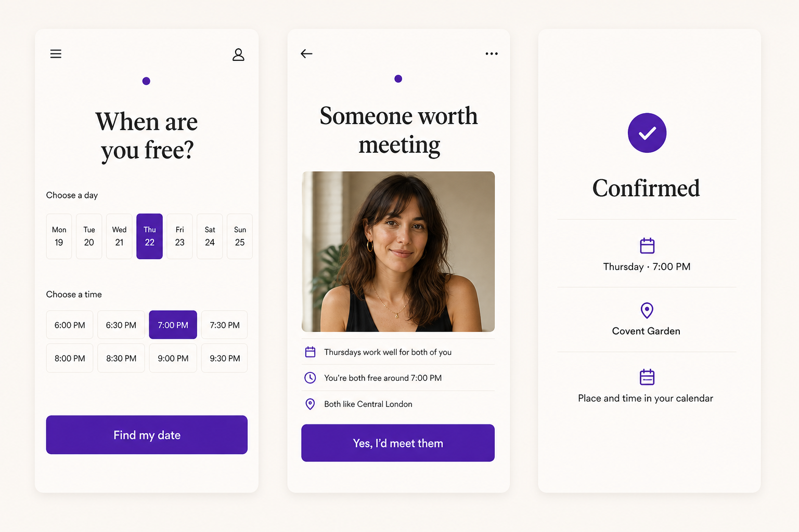
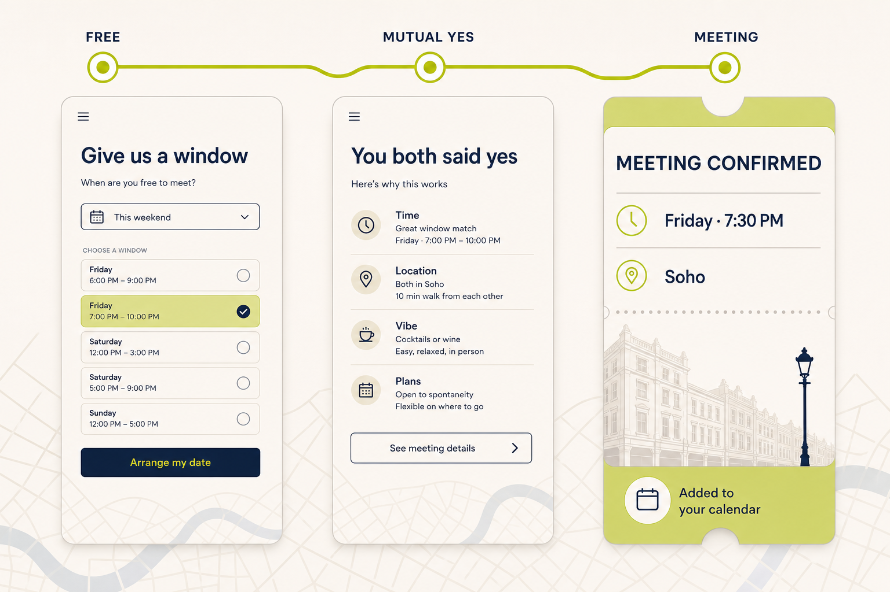
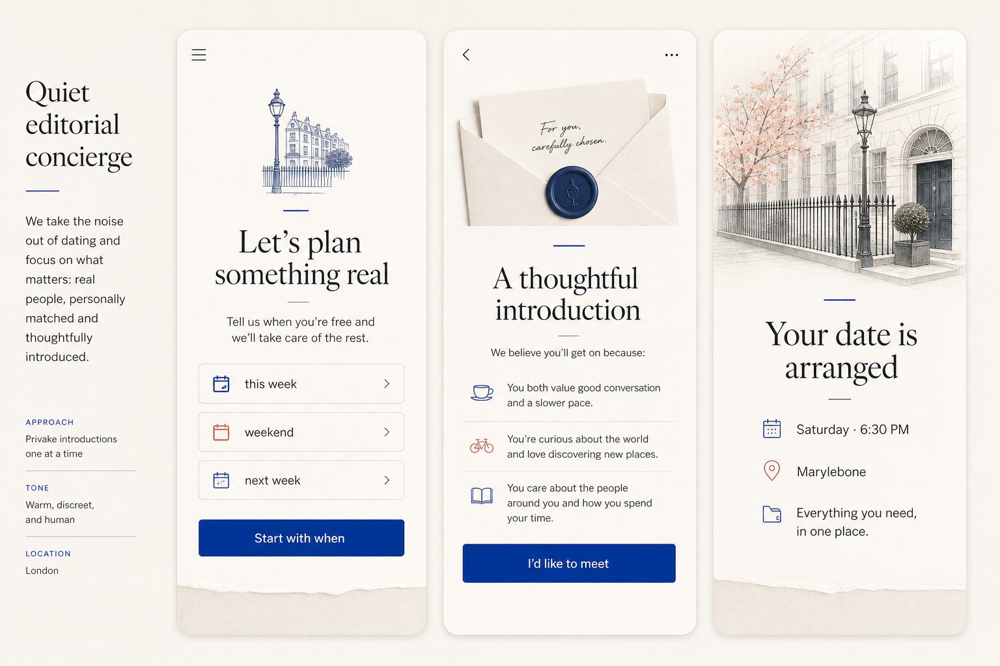

# Together — Product Design Exploration

**Status:** Directional concepts, not approved product screens  
**Created:** 2026-07-23

These images explore the eventual app only. They are not assets for the
appetite landing page and do not authorise product development before the
registration threshold is met.

## Inspiration scan

The useful references are interaction patterns, not visual templates:

- [Timeleft](https://timeleft.com/) makes venue and logistics feel handled, but
  its product is an activity and group-booking catalogue.
- [Thursday](https://www.thursday.com/) makes offline participation central,
  but its core interface remains event-led.
- [Sitch](https://apps.apple.com/us/app/sitch-matchmaking-and-dating/id6478976426)
  demonstrates curated introductions, but leads with a matchmaker and profile
  questionnaire.
- [PLANBELLA](https://www.planbella.com/app/planbella_app/) demonstrates how
  restrained calendar hierarchy can make a future commitment feel concrete.
- [DateSpot](https://www.datespot.love/) demonstrates human curation, but its
  service reads as professional matchmaking rather than an availability-first
  consumer app.

Together's visual white space is the combination:

`availability → mutual choice → arranged date`

The interface should feel closer to a calm appointment or journey confirmation
than a profile feed, event catalogue, or chat product.

## Concept A — Calendar-first certainty

**Strengths**

- Immediate comprehension
- Strong availability and confirmation states
- Consistent with the appetite-page palette

**Risk**

The large portrait on the introduction screen returns to familiar dating-card
grammar. Keep the single-proposal behaviour, but reduce profile-card dominance.

## Concept B — London meeting ticket

**Strengths**

- Strongest competition-relative signature
- Makes progress to a real meeting visible
- Treats confirmation as the product climax
- Feels London-specific without relying on tourist imagery

**Risk**

Chartreuse and ticket styling could become novelty if applied too literally.
Keep the route structure and information hierarchy; refine the palette against
the established Together identity.

## Concept C — Quiet editorial concierge

**Strengths**

- Human, considered, and calm
- Makes curation feel intentional
- Avoids dating-app feed conventions

**Risk**

Paper texture, wax-seal imagery, and serif dominance imply expensive
traditional matchmaking. That could narrow appeal and conflict with a scalable
consumer service.

## Recommendation

Use **Concept B's route-to-meeting system** as the product design spine:

1. Free
2. Mutual yes
3. Meeting

Borrow Concept A's scheduling clarity and Concept C's restraint. Avoid the
large dating-profile card, luxury-matchmaker cues, persistent chat, and event
browsing.

No product UI should be implemented until the London appetite test crosses its
pre-committed build threshold.

## Generation

The concepts were generated with the built-in image-generation tool using
original prompts. No competitor screenshots were used as image inputs.
